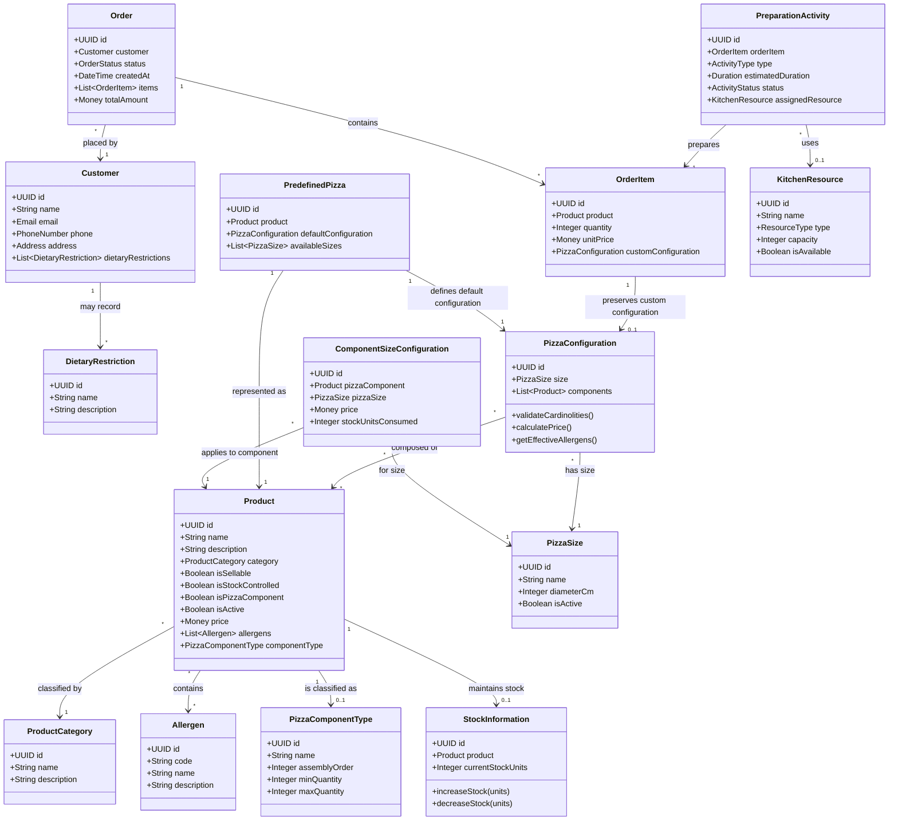

# ARC01 — Core Domain Analysis and Modelling

## 1. Overview
Acest document stabilește modelul conceptual de domeniu (**Domain-Driven Design - DDD**) pentru sistemul informațional **LaPrizza**, conform cerințelor descrise în *PART II – System Specification* și *PART III – Sprint 1 User Stories*.

Modelul de domeniu izolează conceptele pure de business de detaliile tehnice de persistență, infrastructură sau interfață utilizator.

---

## 2. Diagrama Conceptuală a Domeniului (Mermaid)

---

## 3. Concepte Principale și Reguli de Business (Invariants)

### 3.1 Utilizatori și Autentificare (BCK01, BCK02)
* **User & Role**: Fiecare utilizator are credențiale securizate (hash parole prin Argon2/Bcrypt) și un set de roluri (`Manager`, `Staff`, `Customer`).
* **Customer**: Poate avea restricții alimentare (`DietaryRestriction`) asociate cu alergenii cunoscuți.
* **Integritate**: Informațiile unui client referențiat în comenzi istorice nu pot fi șterse fizic (Soft Delete).

### 3.2 Produse, Categorii și Alergeni (BCK03, BCK04, BCK05)
* **Product**: Reprezintă orice articol gestionat de restaurant.
  * Nu orice produs este direct vânzabil (`isSellable = true/false`).
  * Un produs poate fi ingredient de pizza (`isPizzaComponent = true/false`).
  * Un produs poate fi supus gestiunii de stoc (`isStockControlled = true/false`).
* **Integritate Categorii & Alergeni**: O categorie sau un alergen asociat cu produse active nu poate fi șters fără reasocierea produselor.
* **Allergens**: O listă configurabilă de alergeni oficiali asociați produselor.

### 3.3 Mărimi și Tipuri de Componente Pizza (BCK06, BCK07)
* **PizzaSize**: Ex: *Small*, *Medium*, *Large*.
* **PizzaComponentType**: Tipul rolului pe care îl joacă un ingredient:
  1. `Base Dough` (Aluat): `assemblyOrder = 1`, `min = 1`, `max = 1`
  2. `Base Sauce` (Sos bază): `assemblyOrder = 2`, `min = 0`, `max = 1`
  3. `Cheese` (Brânză): `assemblyOrder = 3`, `min = 0`, `max = 1`
  4. `Topping` (Ingrediente adiționale): `assemblyOrder = 4`, `min = 0`, `max = unbounded (null)`
* **Regulă**: Două tipuri de componente nu pot avea aceeași ordine de asamblare (`assemblyOrder` este unic).

### 3.4 Configurația Componentelor per Mărime (BCK08)
* Pentru fiecare pereche `(PizzaComponent, PizzaSize)`, poate exista cel mult o configurație `ComponentSizeConfiguration`.
* Stabilește:
  * Prețul componentei pentru mărimea respectivă (`price >= 0`).
  * Numărul de unități abstracte de stoc consumate (`stockUnitsConsumed >= 0`).

### 3.5 Gestiunea Stocului (BCK09)
* Folosește un model de **unități abstracte** (*Abstract Stock Units*) reprezentate ca numere întregi nenegative (`Integer >= 0`).
* Nu se permite ca o reducere de stoc să producă stoc negativ. Operațiunile de incrementare/decrementare sunt atomice.

### 3.6 Pizza Predefinită și Catalog (BCK10, BCK11)
* O **Predefined Pizza** (ex: *Margherita*) este reprezentată de un produs vânzabil și are o configurație implicită (`PizzaConfiguration`).
* **Regulă de disponibilitate mărimi**: O pizza predefinită poate fi vândută doar la mărimile pentru care **toate** componentele din rețeta sa au definite `ComponentSizeConfiguration`.
* **Regulă de cardinalitate**: Rețeta trebuie să respecte constrângerile de `minQuantity` și `maxQuantity` ale fiecărui `PizzaComponentType`.
* **Alergenii unei pizza**: Sunt calculați dinamic ca reuniunea alergenilor tuturor componentelor din configurație.
