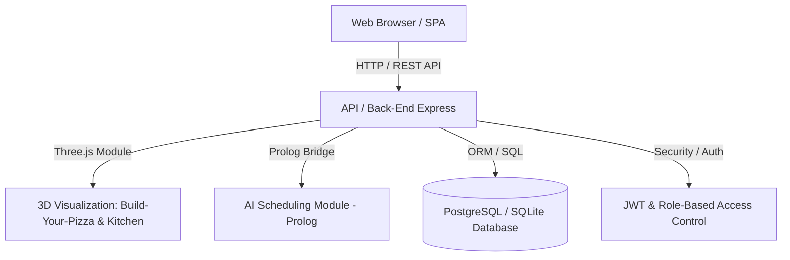
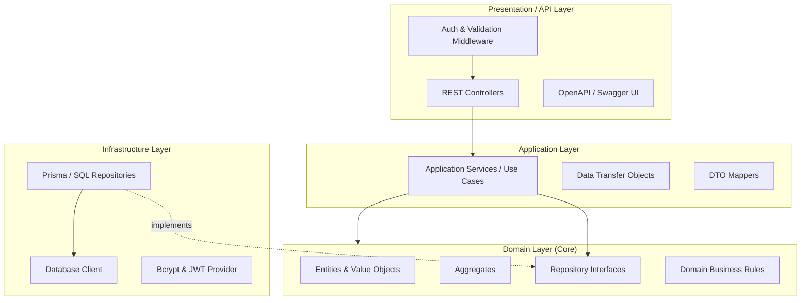

# ARC02 — System Architecture

## 1. Overview
Acest document descrie arhitectura sistemului **LaPrizza**, proiectat pentru integrarea progresivă a componentelor din cadrul disciplinelor LEI Semestrul 5 (ARQSI, LAPR5, SGRAI, IART, ASIST).

---

## 2. Arhitectura de Ansamblu a Sistemului (High-Level Context)

---

## 3. Arhitectura Back-End (Clean Architecture / Onion Architecture)

Sistemul Back-End este organizat în 4 straturi concentrice, respectând **Dependency Inversion Principle**:

### Rolul Fiecărui Strat:
1. **Domain Layer (Miezul):**
   * Conține entitățile pure (`Product`, `PizzaConfiguration`, `StockInformation`, etc.) și regulile de business (invarianți).
   * **Complet independent** de librării externe, baze de date sau framework-uri HTTP.
2. **Application Layer:**
   * Conține Use Case-urile (serviciile de aplicație), interfețele DTO și mappers.
   * Coordonează execuția fluxurilor de lucru fără a expune entitățile direct către exterior.
3. **Infrastructure Layer:**
   * Implementează interfețele definite în Domain (ex: `PrismaProductRepository` implementează `IProductRepository`).
   * Gestionează persistența prin ORM și accesul la resurse externe.
4. **Presentation Layer (API):**
   * Rutele Express, Controller-ele HTTP, validarea request-urilor cu **Zod**, documentația Swagger / OpenAPI.

---

## 4. Integrarea cu celelalte module (SGRAI, IART, ASIST)
* **SGRAI (3D Visualization):**
  * Modulul Three.js consumă API-urile REST (`/api/catalog`, `/api/pizza-sizes`, `/api/pizza-component-types`) pentru a randa în 3D configuratorul "Build Your Pizza" și starea bucătăriei.
* **IART (AI Scheduling):**
  * Comenzile confirmate și activitățile de preparare (`PreparationActivity`) sunt trimise modulului Prolog pentru planificare și alocarea cuptoarelor.
* **ASIST (Infrastructure):**
  * Aplicația este containerizată cu Docker și pregătită pentru orchestrare, backup automat și monitorizare.
