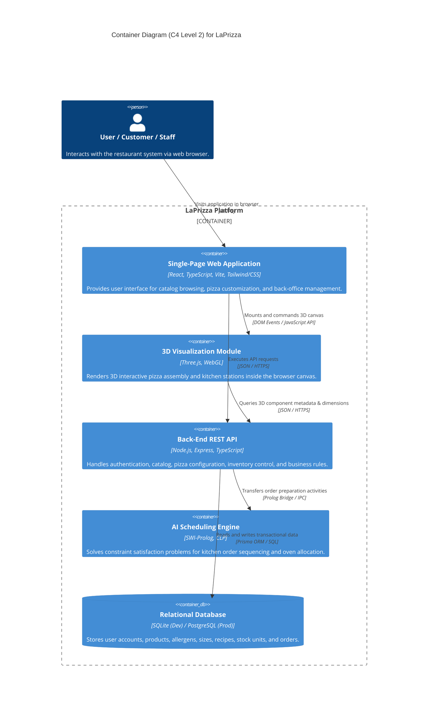

# Component Diagrams — System Containers & Internal Architecture

## 1. Overview
This document specifies the structural decomposition of the **LaPrizza** Information System using the **C4 Model** (Level 2 Container Diagram and Level 3 Component Diagram).

The architecture adheres to Clean / Onion Architecture, ensuring the core domain is strictly shielded from external framework dependencies, persistence mechanisms, and communication protocols.

---

## 2. C4 Model — Level 2: Container Diagram

The Container diagram illustrates the high-level software containers that form the LaPrizza ecosystem, their inter-communications, and data stores:

---

## 3. C4 Model — Level 3: Back-End Component Diagram

The Component diagram reveals the internal structural decomposition of the **Back-End REST API** container according to the 4 Clean Architecture layers:

```mermaid
graph TD
    subgraph PresentationLayer ["1. Presentation Layer (API & HTTP)"]
        Routes[Express Router]
        AuthCtrl[AuthController]
        ProductCtrl[ProductController]
        StockCtrl[StockController]
        CatalogCtrl[CatalogController]
        SizeCtrl[PizzaSizeController]
        AuthMW[Auth Middleware - JWT]
        ZodMW[Zod Validation Middleware]
        ErrorMW[Global Error Middleware]
    end

    subgraph ApplicationLayer ["2. Application Layer (Use Cases & DTOs)"]
        AuthSvc[AuthService]
        ProductSvc[ProductService]
        StockSvc[StockService]
        CatalogSvc[PizzaCatalogService]
        SizeSvc[PizzaSizeService]
        DTOs[Data Transfer Objects]
        Mappers[DTO / Domain Mappers]
    end

    subgraph DomainLayer ["3. Domain Layer (Pure Business Core)"]
        subgraph Entities ["Entities & Value Objects"]
            EntProduct[Product]
            EntStock[StockInformation]
            EntConfig[PizzaConfiguration]
            EntSize[PizzaSize]
            EntType[PizzaComponentType]
            VOAllergen[Allergen]
            VOMoney[Money]
        end
        subgraph Interfaces ["Repository Interfaces"]
            IProductRepo[IProductRepository]
            IStockRepo[IStockRepository]
            ISizeRepo[IPizzaSizeRepository]
            IUserRepo[IUserRepository]
        end
    end

    subgraph InfrastructureLayer ["4. Infrastructure Layer (Persistence & Tech)"]
        PrismaClient[(Prisma Client)]
        PrismaProductRepo[PrismaProductRepository]
        PrismaStockRepo[PrismaStockRepository]
        PrismaSizeRepo[PrismaPizzaSizeRepository]
        BcryptProvider[Bcrypt Password Provider]
    end

    %% Presentation to Application
    Routes --> AuthCtrl
    Routes --> ProductCtrl
    Routes --> StockCtrl
    Routes --> CatalogCtrl
    Routes --> SizeCtrl
    ZodMW --> Routes
    AuthMW --> Routes

    AuthCtrl --> AuthSvc
    ProductCtrl --> ProductSvc
    StockCtrl --> StockSvc
    CatalogCtrl --> CatalogSvc
    SizeCtrl --> SizeSvc

    %% Application to Domain
    AuthSvc --> IUserRepo
    ProductSvc --> IProductRepo
    StockSvc --> IStockRepo
    CatalogSvc --> IProductRepo
    CatalogSvc --> ISizeRepo
    SizeSvc --> ISizeRepo

    ProductSvc --> EntProduct
    StockSvc --> EntStock
    CatalogSvc --> EntConfig

    %% Infrastructure Implementations (DIP)
    PrismaProductRepo -.->|implements| IProductRepo
    PrismaStockRepo -.->|implements| IStockRepo
    PrismaSizeRepo -.->|implements| ISizeRepo
    PrismaProductRepo --> PrismaClient
    PrismaStockRepo --> PrismaClient
    PrismaSizeRepo --> PrismaClient
    AuthSvc --> BcryptProvider
```

---

## 4. Layer Responsibilities & Contracts

| Layer | Responsibility | Allowed Dependencies | Forbidden Dependencies |
| :--- | :--- | :--- | :--- |
| **Domain** | Contains core entities, business invariants, and repository contracts. | None (pure language primitives, internal domain types). | Express, Prisma, HTTP, Database drivers, external libraries. |
| **Application** | Implements use cases, orchestrates domain entities, and handles data mapping between DTOs and entities. | Domain Layer. | Express HTTP request/response objects, database drivers. |
| **Infrastructure** | Implements repository interfaces using Prisma ORM, connects to SQLite/PostgreSQL, handles password hashing. | Domain Layer (implements its interfaces), external libraries (`@prisma/client`, `bcryptjs`). | Presentation Layer. |
| **Presentation** | Handles HTTP routing, input sanitization with Zod, JWT authentication, and Swagger docs. | Application Layer, Domain Layer (types only). | Direct database access or Prisma Client calls. |

---

## 5. Typical Request Lifecycle

1. **HTTP Inbound**: A `POST /api/products` request arrives at the Express router.
2. **Validation**: `ZodValidationMiddleware` validates the request body against `CreateProductSchema`. If invalid, an HTTP 400 response is returned immediately.
3. **Authentication**: `AuthMiddleware` verifies the JWT token and confirms the user possesses the `MANAGER` role.
4. **Use Case Execution**: The controller invokes `ProductService.createProduct(dto)`.
5. **Domain Instantiation**: `ProductService` creates a new `Product` entity, which verifies that all domain invariants hold.
6. **Persistence**: `ProductService` invokes `IProductRepository.save(product)`.
7. **Infrastructure Execution**: `PrismaProductRepository` persists the entity via `prisma.product.create(...)`.
8. **HTTP Outbound**: The service maps the saved entity to a `ProductResponseDTO` and the controller sends an HTTP 201 Created response.
