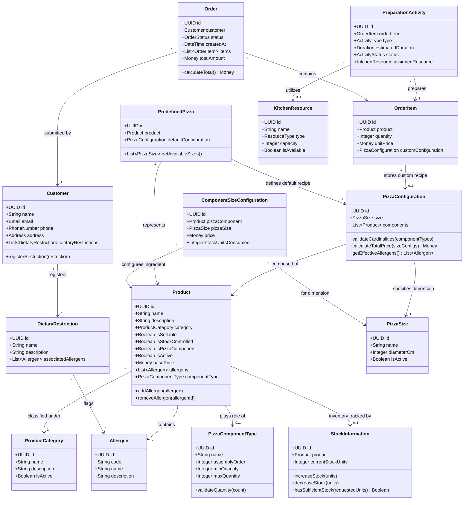

# Domain Model — Core Business Analysis & Modelling

## 1. Overview
This document specifies the conceptual and tactical **Domain Model** for the **LaPrizza** Information System, formulated using **Domain-Driven Design (DDD)** principles.

The domain layer encapsulates all business logic, invariants, entity relationships, and aggregate boundaries, isolated from persistence technologies (Prisma/PostgreSQL) and presentation protocols (REST/Express/React).

---

## 2. Ubiquitous Language (Glossary)

| Domain Term | Definition |
| :--- | :--- |
| **Product** | Any commercial item managed by the restaurant. Can be sellable directly, controlled by stock, and/or classified as a pizza component. |
| **ProductCategory** | A high-level classification for products (e.g., Beverages, Desserts, Pizza Ingredients, Packaged Snacks). |
| **Allergen** | A recognized substance (e.g., Gluten, Lactose, Peanuts) that may cause allergic reactions. Associated with products. |
| **DietaryRestriction** | A dietary preference or medical restriction declared by a Customer (e.g., Vegan, Gluten-Free). |
| **PizzaSize** | A standardized pizza dimension characterized by name (e.g., Small, Medium, Large) and diameter in cm. |
| **PizzaComponentType** | A structural role for pizza ingredients (e.g., *Base Dough*, *Base Sauce*, *Cheese*, *Topping*). Governed by assembly order and quantity limits. |
| **ComponentSizeConfiguration**| The pairing of a Pizza Component and a Pizza Size that defines its specific retail price and abstract stock consumption. |
| **StockInformation** | Abstract integer inventory units tracked per stock-controlled product. Invariant: `units >= 0`. |
| **PredefinedPizza** | A menu pizza recipe (e.g., *Margherita*) backed by a sellable product and an immutable default component configuration. |
| **PizzaConfiguration** | A specific composition of ingredients for a given size, satisfying component type cardinalities. |
| **Order & OrderItem** | An operational transaction placed by a Customer containing items, unit prices, and optional custom pizza configurations. |
| **PreparationActivity** | A discrete kitchen task (dough stretching, topping, baking) allocated to resources for AI scheduling (IART). |

---

## 3. Domain Model Class Diagram (Mermaid)

---

## 4. Invariants & Business Rules

### 4.1 Cardinalities and Assembly Ordering
1. **Uniqueness of Assembly Order**: Every `PizzaComponentType` has a strictly unique `assemblyOrder` integer (e.g., 1 for Dough, 2 for Sauce, 3 for Cheese, 4 for Toppings). No two types may share the same assembly order.
2. **Component Quantity Constraints**:
   * For every component type $T$ present in a pizza recipe:
     $$\text{minQuantity}(T) \le \text{count}(c \in \text{components} \mid \text{type}(c) = T) \le \text{maxQuantity}(T)$$
   * Standard culinary default:
     * *Base Dough*: $\min = 1, \max = 1$ (mandatory).
     * *Base Sauce*: $\min = 0, \max = 1$ (optional base).
     * *Cheese*: $\min = 0, \max = 2$ (optional/customizable).
     * *Toppings*: $\min = 0, \max = \text{unbounded}$.

### 4.2 Size-Dependent Availability
* A `PredefinedPizza` can only be offered in a given `PizzaSize` if **every single component** in its recipe has an active `ComponentSizeConfiguration` defined for that size. If an ingredient lacks configuration for *Large*, the pizza cannot be ordered in *Large*.

### 4.3 Abstract Stock Invariant
* Stock units are non-negative integers ($\mathbb{Z}_{\ge 0}$).
* Decrement operations must fail atomically if $\text{currentUnits} - \text{requestedUnits} < 0$.

### 4.4 Dynamic Allergen Propagation
* The allergens of a pizza configuration are dynamically derived as the set union of all allergens present in its constituent ingredients:
  $$\text{Allergens}(\text{Configuration}) = \bigcup_{c \in \text{Components}} \text{Allergens}(c)$$
