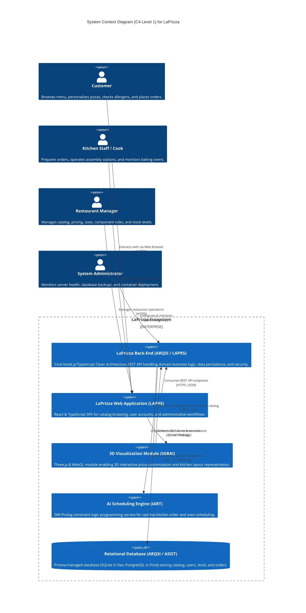

# 02 — System Context

## 1. Overview
This document defines the high-level operational context of the **LaPrizza** Information System. It illustrates the boundaries of the system, its primary human actors, external system integrations, and the inter-module relationships across the five participating course units of the ISEP LEI 5th Semester.

---

## 2. C4 Model — Level 1: System Context Diagram

The following diagram captures the boundary of the LaPrizza system and its interactions with human actors and external systems:

---

## 3. Human Actors & Responsibilities

| Actor | Role & Responsibilities | Key System Touchpoints |
| :--- | :--- | :--- |
| **Customer** | End-user purchasing food. Authenticates, declares dietary restrictions, inspects allergens, customizes pizzas, and reviews order history. | Web App (Client Portal), 3D Pizza Builder, Public REST API. |
| **Kitchen Staff** | Operational staff executing culinary tasks. Receives prioritized order activities, reports status transitions (prep, baking, ready). | Web App (Kitchen Dashboard), 3D Kitchen Visualization. |
| **Restaurant Manager** | Business administrator. Creates products, sets prices, configures pizza component types and cardinalities, adjusts stock levels. | Web App (Admin Portal), Management REST API (`/api/catalog`, `/api/stock`, `/api/sizes`). |
| **System Administrator** | DevOps & infrastructure specialist. Oversees CI/CD, database backups, environment variables, and Docker container orchestration. | Server OS, Docker Engine, PostgreSQL, Reverse Proxy (Nginx). |

---

## 4. Academic Course Unit Responsibilities & Cross-Module Interfaces

The LaPrizza system integrates five complementary academic disciplines:

```mermaid
graph LR
    subgraph ARQSI ["ARQSI (Architecture)"]
        CleanArch["Clean Architecture Spine"]
        DomainCore["DDD Core Business Logic"]
        RestContracts["REST API Contracts (OpenAPI)"]
    end

    subgraph LAPR5 ["LAPR5 (Integration)"]
        FullStack["Full-Stack Assembly"]
        FrontendSPA["React/TypeScript Web App"]
        SprintExecution["Agile Scrum Lifecycle"]
    end

    subgraph SGRAI ["SGRAI (Computer Graphics)"]
        ThreeJS["Three.js 3D WebGL Engine"]
        BuildPizza3D["3D Pizza Configurator"]
        Kitchen3D["3D Kitchen Station Viewer"]
    end

    subgraph IART ["IART (Artificial Intelligence)"]
        PrologEngine["Prolog Constraint Engine"]
        OvenSched["Oven & Resource Scheduling"]
    end

    subgraph ASIST ["ASIST (Systems Administration)"]
        DockerEnv["Docker Multi-Stage Builds"]
        DbAdmin["PostgreSQL Administration & Backup"]
        NetSecurity["Network & Security Configuration"]
    end

    ARQSI --> LAPR5
    ARQSI --> SGRAI
    ARQSI --> IART
    ARQSI --> ASIST
    LAPR5 --> SGRAI
    LAPR5 --> IART
    ASIST --> LAPR5
```

### Module Interface Contracts:
1. **Back-End to Front-End (`ARQSI` ↔ `LAPR5`)**:
   * Synchronous REST API over HTTPS communicating via structured JSON payloads.
   * Input/output validation guarded by TypeScript DTOs and Zod validation schemas.
   * Authentication via stateless Bearer JWT tokens.
2. **Back-End to 3D Visualization (`ARQSI` ↔ `SGRAI`)**:
   * Front-end invokes `/api/pizza-component-types`, `/api/pizza-sizes`, and `/api/products` to fetch ingredient 3D asset metadata (texture paths, mesh scaling factors, layering order).
3. **Back-End to AI Scheduler (`ARQSI` ↔ `IART`)**:
   * Confirmed orders with their respective `PreparationActivity` requirements are translated into Prolog facts (`order(Id, EstTime, RequiredStation, Deadline)`).
   * The Prolog CLP solver computes the optimal queue sequence and oven slot assignments.
4. **Application to Systems Administration (`ARQSI / LAPR5` ↔ `ASIST`)**:
   * Zero-configuration environment variable injection (`.env`).
   * Multi-stage Docker containers with non-root security profiles.
   * Automated database migration and seeding scripts (`prisma db push`, `prisma db seed`).
